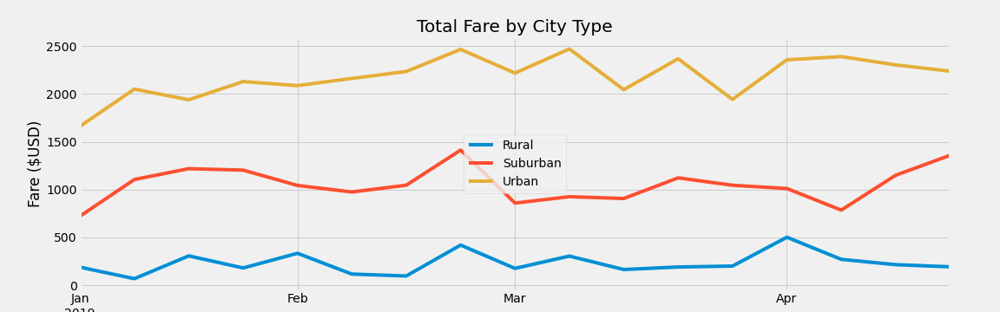
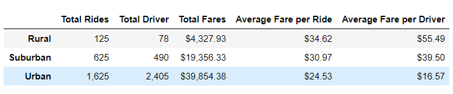

# PyBer_Analysis
## Overview of the analysis
The purpose of this analysis is to summarize the Pyber riding data for total Rides, total driver, total Fares, average fare per ride and average fare per driver based on city typr, and to analyze the total fares of riding the Pyber by City Type in order to assist management at PyBer to make decisions.

## Results:

 Based on the ride data summary:

 

 

  We can tell the Urban area has more riders of 1,625, with higher total fares of $39,854. The average fares of rides in the urban area are lowest comparing to other city types at $24.53. There are more drivers (2,405) in the Urban area which led to a lower average fare per driver at $16.57. There are more drivers than the riders in the urban area.
 
 The rural area has fewer total rides (125) and fewer drivers (78). The total fares are $4,327.93. The average fares of rides in the rural area are highest comparing to other city types at $34.62. As there are fewer drivers in the rural area and average fares of rides are the highest result in higher average fare per driver at $55.49. There are more riders than the drivers in the rural area.
 
 In comparison to the urban area and rural area, the figure of the suburban falls in between the urban area and rural area. The riders in the suburban area are 625 and the drivers amount is 490. The total fares are $19,356.33. The average fares of rides in the suburban area are in the middle of three city types at $30.97. The average fare per driver in the suburban area is $$39.50.

## Summary:

In summary, there are more drivers than the riders in the urban area. The supplies for the Pyber ride are more than the demand and therefore the average fare per driver is the lowest at $16.57. On the other hand, there are more riders than drivers in rural area. The supplies for the Pyber ride are less than the demand for the ride and therefore the average fare per driver is the highest at $55.49. 

Based on the above result. I have three recommendation as below:
1. Decrease drivers amount in the urban area. There are too many drivers in the urban area. Although the total riders and total fares are the highest among the three city types, the oversupply of the ride leads to less profitable for each driver.

2. Increase drivers in rural area. As there are fewer drivers than riders, there is chances that rider is not able to take Pyber because there the driver is not sufficient for drivers. With more drivers, the average fare per driver will decrease.

3. Slightly increase the drivers amount in the suburban area. As there are fewer drivers than riders, there is still some room for additional drivers in the suburban area to improve the wait time for the rider.

